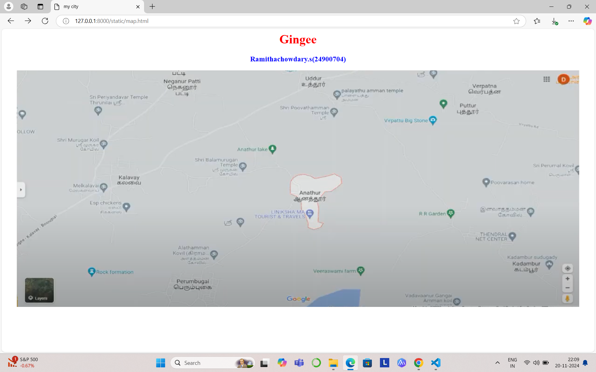
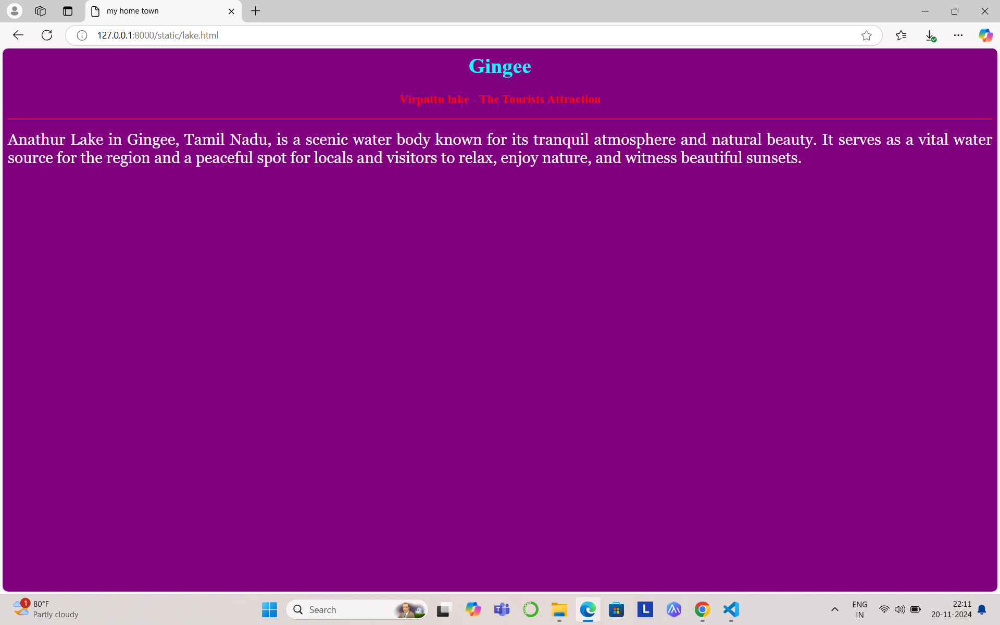
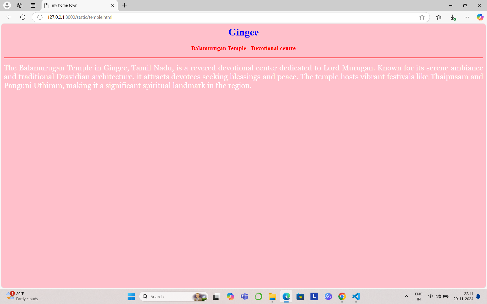
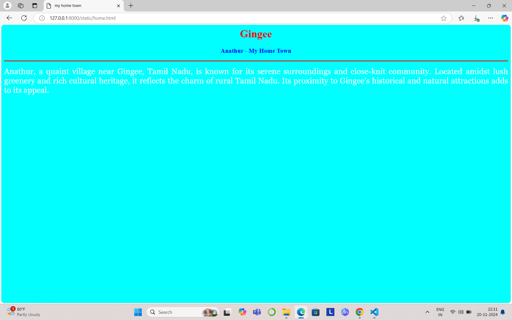
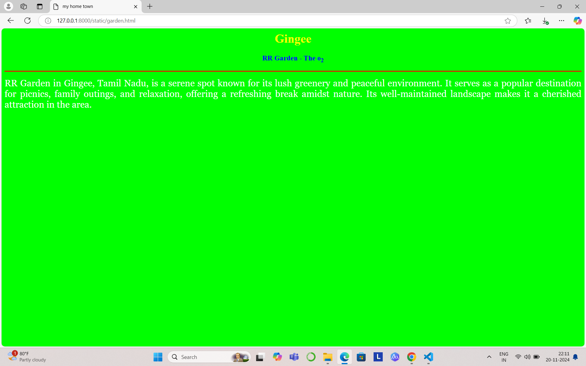
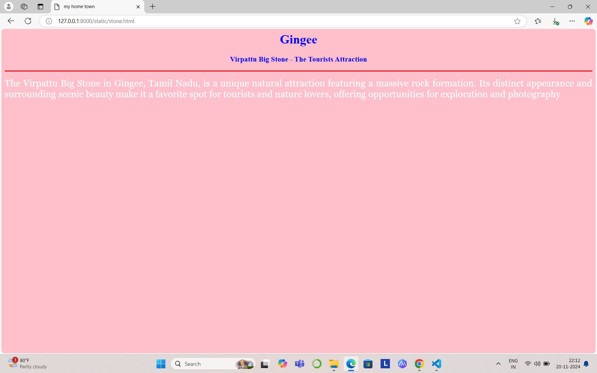

# Ex04 Places Around Me
## Date:20.11.2024 

## AIM
To develop a website to display details about the places around my house.

## DESIGN STEPS

### STEP 1
Create a Django admin interface.

### STEP 2
Download your city map from Google.

### STEP 3
Using ```<map>``` tag name the map.

### STEP 4
Create clickable regions in the image using ```<area>``` tag.

### STEP 5
Write HTML programs for all the regions identified.

### STEP 6
Execute the programs and publish them.

## CODE
```
map.html

<html>
    <head>
        <title>
            my city
        </title>
    </head>
    <body>
        <h1 align="center">
        <font color="red"><b>Gingee</b></font></h1>
        <h3 align="center">
        <font color="blue"><b>Ramithachowdary.s(24900704)

        </b></font></h3>
        <center>
            
            <map name="MyCity">
            <area shape="rect" coords="700,250,850,400" href="home.html" title="My Home Town">
            <area shape="circle" coords="570,230,45" href="temple.html" title="Balamurugan temple">
            <area shape="circle" coords="640,200,30" href="lake.html" title="Anathur temple">
            <area shape="circle" coords="1120,360,25" href="garden.html" title="RR Garden">
            <area shape="rect" coords="950,120,1100,140" href="stone.html" title="virupattu Big Street">

            </map>
        </center>
    </body>
</html> 

garden.html

<html>
    <head>
        <title>
            my home town
        </title>
    </head>
    <body bgcolor="lime">
        <h1 align="center">
            <font color="yellow"><b>Gingee</b></font>
        </h1>
        <h3
            align="center">
            <font color="blue"><b>RR Garden - The o<sub>2</sub></b></font>
        </h3>
        <hr size="3" color="red">
        <p align="justify">
            <font face="Georgia" size="5" color="white">
                RR Garden in Gingee, Tamil Nadu, is a serene spot known for its
                 lush greenery and peaceful environment. It serves as a popular
                  destination for picnics, family outings, and relaxation, 
                  offering a refreshing break amidst nature. Its well-maintained 
                landscape makes it a cherished attraction in the area.
            </font>
        </p>
    </body>
</html>

home.html

<html>
    <head>
        <title>
            my home town
        </title>
    </head>
    <body bgcolor="cyan">
        <h1 align="center">
            <font color="red"><b>Gingee</b></font>
        </h1>
        <h3
            align="center">
            <font color="blue"><b>
               Anathur - My Home Town 
            </b></font>
        </h3>
        <hr size="3" color="red">
        <p align="justify">
            <font face="Georgia" size="5" color="white">
                Anathur, a quaint village near Gingee, Tamil Nadu, is known 
                for its serene surroundings and close-knit community. Located 
                amidst lush greenery and rich cultural heritage, 
                it reflects the charm of rural Tamil Nadu.
                 Its proximity to Gingee's 
                historical and natural attractions adds to its appeal. 
            </font>
        </p>
    </body>
</html>

lake.html

<html>
    <head>
        <title>
            my home town
        </title>
    </head>
    <body bgcolor="purple">
        <h1 align="center">
            <font color="cyan"><b>Gingee</b></font>
        </h1>
        <h3
            align="center">
            <font color="red"><b>Virpattu lake - The Tourists Attraction</b></font>
        </h3>
        <hr size="3" color="red">
        <p align="justify">
            <font face="Georgia" size="5" color="white">
                Anathur Lake in Gingee, Tamil Nadu, is a scenic water
                 body known for its tranquil atmosphere and natural
                  beauty. It serves as a vital water source for the 
                  region and a peaceful spot for locals and 
                  visitors to relax, enjoy nature, and witness 
                  beautiful sunsets.

            </font>
        </p>
    </body>
</html>

stone.html

<html>
    <head>
        <title>
            my home town
        </title>
    </head>
    <body bgcolor="pink">
        <h1 align="center">
            <font color="blue"><b>Gingee</b></font>
        </h1>
        <h3
            align="center">
            <font color="blue"><b>Virpattu Big Stone - The Tourists Attraction</b></font>
        </h3>
        <hr size="3" color="red">
        <p align="justify">
            <font face="Georgia" size="5" color="white">
                The Virpattu Big Stone in Gingee, Tamil Nadu, is a unique
                 natural attraction featuring a massive rock formation. 
                 Its distinct appearance and surrounding scenic beauty
                  make it a favorite spot for tourists and nature lovers, 
                offering opportunities for exploration and photography     
            </font>
        </p>
    </body>
</html>

temple.html

<html>
    <head>
        <title>
            my home town
        </title>
    </head>
    <body bgcolor="pink">
        <h1 align="center">
            <font color="blue"><b>Gingee</b></font>
        </h1>
        <h3
            align="center">
            <font color="red"><b>Balamurugan Temple - Devotional centre</b></font>
        </h3>
        <hr size="3" color="red">
        <p align="justify">
            <font face="Georgia" size="5" color="white">
                The Balamurugan Temple in Gingee, Tamil Nadu, is a
                 revered devotional center dedicated to Lord Murugan.
                  Known for its serene ambiance and traditional 
                  Dravidian architecture, it attracts devotees
                   seeking blessings and peace. The temple hosts
                    vibrant festivals like Thaipusam and Panguni 
                    Uthiram, making it a significant spiritual 
                    landmark in the region.
            </font>
        </p>
    </body>
</html>
```


# OUTPUT








## RESULT
The program for implementing image maps using HTML is executed successfully.
